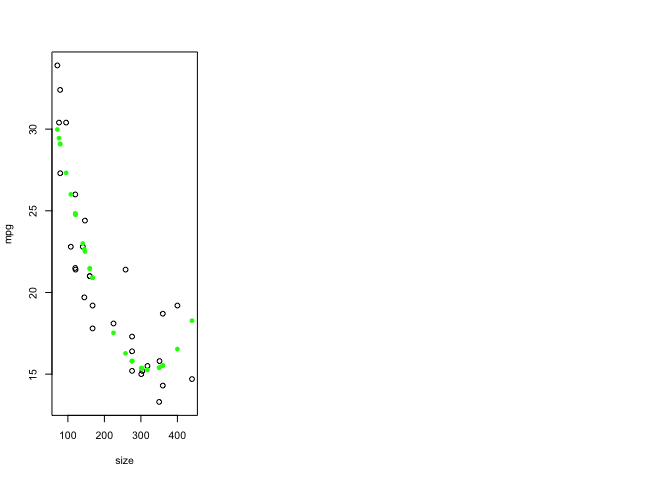

# Polynomials 
## Chapter 5.1 in Sheather 

Common R Command: 
  - poly 


```r
load("/Users/isabellelangrock/Desktop/Stats500/Rst500.RData")
library(ltm)
```

```
## Loading required package: MASS
```

```
## Loading required package: msm
```

```
## Loading required package: polycor
```

```r
library(car) 
```

```
## Loading required package: carData
```

```r
library(rms)
```

```
## Loading required package: Hmisc
```

```
## Loading required package: lattice
```

```
## Loading required package: survival
```

```
## Loading required package: Formula
```

```
## Loading required package: ggplot2
```

```
## 
## Attaching package: 'Hmisc'
```

```
## The following objects are masked from 'package:base':
## 
##     format.pval, units
```

```
## Loading required package: SparseM
```

```
## 
## Attaching package: 'SparseM'
```

```
## The following object is masked from 'package:base':
## 
##     backsolve
```

```
## 
## Attaching package: 'rms'
```

```
## The following objects are masked from 'package:car':
## 
##     Predict, vif
```


```r
attach(cars)
```

```
## The following object is masked from package:ggplot2:
## 
##     mpg
```

```r
plot(size,mpg)
size2<-size^2 
m<-lm(mpg~size+size2)
plot(size,mpg)
points(size, m$fit, pch=16, col="orange")
```

<!-- -->

```r
## The importance of centering
sizec2<-(size-mean(size))^2
cor(cbind(size,size2, sizec2))
```

```
##             size     size2    sizec2
## size   1.0000000 0.9820564 0.4006507
## size2  0.9820564 1.0000000 0.5662511
## sizec2 0.4006507 0.5662511 1.0000000
```

```r
bad<- 900:910
bad
```

```
##  [1] 900 901 902 903 904 905 906 907 908 909 910
```

```r
bad^2
```

```
##  [1] 810000 811801 813604 815409 817216 819025 820836 822649 824464 826281
## [11] 828100
```

```r
plot(bad, bad^2)
```

<!-- -->

```r
plot(bad - 900, (bad-900)^2)
```

<!-- -->

```r
plot(size,mpg)
points(size,m$fit, pch=16, col="orange")
summary(m)
```

```
## 
## Call:
## lm(formula = mpg ~ size + size2)
## 
## Residuals:
##    Min     1Q Median     3Q    Max 
## -3.575 -1.757 -0.173  1.421  5.128 
## 
## Coefficients:
##               Estimate Std. Error t value Pr(>|t|)    
## (Intercept)  3.938e+01  2.199e+00  17.912  < 2e-16 ***
## size        -1.486e-01  2.190e-02  -6.783 2.76e-07 ***
## size2        2.286e-04  4.581e-05   4.990 3.12e-05 ***
## ---
## Signif. codes:  0 '***' 0.001 '**' 0.01 '*' 0.05 '.' 0.1 ' ' 1
## 
## Residual standard error: 2.471 on 27 degrees of freedom
## Multiple R-squared:  0.8218,	Adjusted R-squared:  0.8087 
## F-statistic: 62.28 on 2 and 27 DF,  p-value: 7.686e-11
```

```r
m<-lm(mpg~size+sizec2)
points(size, m$fit, pch=16, col="blue")
```

<!-- -->

```r
sizeo2<- lm(size2~size)$residual
par(mfrow=c(1,3))
plot(size, size2)
plot(size, sizec2)
plot(size, sizeo2)
```

<!-- -->

```r
m<- lm(mpg~size+sizeo2)
summary(m)
```

```
## 
## Call:
## lm(formula = mpg ~ size + sizeo2)
## 
## Residuals:
##    Min     1Q Median     3Q    Max 
## -3.575 -1.757 -0.173  1.421  5.128 
## 
## Coefficients:
##               Estimate Std. Error t value Pr(>|t|)    
## (Intercept)  2.960e+01  9.962e-01  29.715  < 2e-16 ***
## size        -4.123e-02  4.130e-03  -9.983 1.47e-10 ***
## sizeo2       2.286e-04  4.581e-05   4.990 3.12e-05 ***
## ---
## Signif. codes:  0 '***' 0.001 '**' 0.01 '*' 0.05 '.' 0.1 ' ' 1
## 
## Residual standard error: 2.471 on 27 degrees of freedom
## Multiple R-squared:  0.8218,	Adjusted R-squared:  0.8087 
## F-statistic: 62.28 on 2 and 27 DF,  p-value: 7.686e-11
```

```r
plot(size,mpg)
points(size, m$fit, pch=16, col="green")
```

<!-- -->

## Fitting a cubic polynomial to the data 
$ y = \beta_{0} + \beta_{1}x + \beta_{2}x^2 + \beta_{3}x^3$ 
Actually, because of centering the values looks like:
$ y = \beta_{0} + \beta_{1}x + \beta_{2}(x- \bar{x})^2 + \beta_{3}(x-\bar{x})^3$


```r
sizec3<- (size-mean(size))^3
m<-lm(mpg~size+sizec2+sizec3)
summary(m)
```

```
## 
## Call:
## lm(formula = mpg ~ size + sizec2 + sizec3)
## 
## Residuals:
##     Min      1Q  Median      3Q     Max 
## -3.0697 -1.7218 -0.4838  1.6173  4.9751 
## 
## Coefficients:
##               Estimate Std. Error t value Pr(>|t|)    
## (Intercept)  2.450e+01  1.909e+00  12.829 9.40e-13 ***
## size        -3.330e-02  7.748e-03  -4.298 0.000214 ***
## sizec2       3.226e-04  5.537e-05   5.827 3.86e-06 ***
## sizec3      -9.554e-07  3.707e-07  -2.578 0.015973 *  
## ---
## Signif. codes:  0 '***' 0.001 '**' 0.01 '*' 0.05 '.' 0.1 ' ' 1
## 
## Residual standard error: 2.248 on 26 degrees of freedom
## Multiple R-squared:  0.8581,	Adjusted R-squared:  0.8417 
## F-statistic: 52.41 on 3 and 26 DF,  p-value: 3.686e-11
```

```r
plot(size, mpg)
points(size, m$fit, pch=16, col="blue")
```

<!-- -->
## The poly function 
Rescales it so it's not too big and takes the orthogonal polynomial. Very numerically stable. 


```r
poly(size,2)
```

```
##                 1           2
##  [1,] -0.24055674  0.26801410
##  [2,] -0.23286891  0.24049777
##  [3,] -0.22785511  0.22297497
##  [4,] -0.22735373  0.22124104
##  [5,] -0.20044631  0.13308138
##  [6,] -0.17888695  0.06937878
##  [7,] -0.15866461  0.01523412
##  [8,] -0.15833036  0.01438477
##  [9,] -0.15716047  0.01142372
## [10,] -0.12406936 -0.06480773
## [11,] -0.11705004 -0.07910952
## [12,] -0.11420888 -0.08471242
## [13,] -0.09198102 -0.12484873
## [14,] -0.09198102 -0.12484873
## [15,] -0.07927938 -0.14483938
## [16,] -0.07927938 -0.14483938
## [17,]  0.01665140 -0.22666034
## [18,]  0.07180324 -0.21840111
## [19,]  0.10155181 -0.19718437
## [20,]  0.10155181 -0.19718437
## [21,]  0.10155181 -0.19718437
## [22,]  0.14366777 -0.14706064
## [23,]  0.14868157 -0.13952532
## [24,]  0.17207932 -0.09994868
## [25,]  0.22555990  0.01779845
## [26,]  0.22723117  0.02208976
## [27,]  0.24227258  0.06237991
## [28,]  0.24227258  0.06237991
## [29,]  0.30912330  0.27777945
## [30,]  0.37597402  0.55249694
## attr(,"coefs")
## attr(,"coefs")$alpha
## [1] 215.0367 254.4616
## 
## attr(,"coefs")$norm2
## [1]          1.0         30.0     358020.4 2910233607.6
## 
## attr(,"degree")
## [1] 1 2
## attr(,"class")
## [1] "poly"   "matrix"
```

```r
x<-1:1000
matplot(x, poly(x,2), type="l")
```

<!-- -->

```r
matplot(x, poly(x,3), type="l")
```

<!-- -->

```r
matplot(x, poly(x,4), type="l")
```

<!-- -->

```r
m<-lm(mpg~poly(size,2))
summary(m)
```

```
## 
## Call:
## lm(formula = mpg ~ poly(size, 2))
## 
## Residuals:
##    Min     1Q Median     3Q    Max 
## -3.575 -1.757 -0.173  1.421  5.128 
## 
## Coefficients:
##                Estimate Std. Error t value Pr(>|t|)    
## (Intercept)     20.7367     0.4512  45.957  < 2e-16 ***
## poly(size, 2)1 -24.6713     2.4715  -9.983 1.47e-10 ***
## poly(size, 2)2  12.3336     2.4715   4.990 3.12e-05 ***
## ---
## Signif. codes:  0 '***' 0.001 '**' 0.01 '*' 0.05 '.' 0.1 ' ' 1
## 
## Residual standard error: 2.471 on 27 degrees of freedom
## Multiple R-squared:  0.8218,	Adjusted R-squared:  0.8087 
## F-statistic: 62.28 on 2 and 27 DF,  p-value: 7.686e-11
```

```r
m<-lm(mpg~poly(size, 3))
summary(m)
```

```
## 
## Call:
## lm(formula = mpg ~ poly(size, 3))
## 
## Residuals:
##     Min      1Q  Median      3Q     Max 
## -3.0697 -1.7218 -0.4838  1.6173  4.9751 
## 
## Coefficients:
##                Estimate Std. Error t value Pr(>|t|)    
## (Intercept)     20.7367     0.4104  50.532  < 2e-16 ***
## poly(size, 3)1 -24.6713     2.2477 -10.976 2.94e-11 ***
## poly(size, 3)2  12.3336     2.2477   5.487 9.33e-06 ***
## poly(size, 3)3  -5.7934     2.2477  -2.578    0.016 *  
## ---
## Signif. codes:  0 '***' 0.001 '**' 0.01 '*' 0.05 '.' 0.1 ' ' 1
## 
## Residual standard error: 2.248 on 26 degrees of freedom
## Multiple R-squared:  0.8581,	Adjusted R-squared:  0.8417 
## F-statistic: 52.41 on 3 and 26 DF,  p-value: 3.686e-11
```

```r
m<-lm(mpg~poly(size, 4))
summary(m)
```

```
## 
## Call:
## lm(formula = mpg ~ poly(size, 4))
## 
## Residuals:
##     Min      1Q  Median      3Q     Max 
## -3.1554 -1.5474 -0.4521  1.5780  4.4035 
## 
## Coefficients:
##                Estimate Std. Error t value Pr(>|t|)    
## (Intercept)     20.7367     0.4112  50.434  < 2e-16 ***
## poly(size, 4)1 -24.6713     2.2521 -10.955 4.93e-11 ***
## poly(size, 4)2  12.3336     2.2521   5.477 1.09e-05 ***
## poly(size, 4)3  -5.7934     2.2521  -2.573   0.0164 *  
## poly(size, 4)4   2.1353     2.2521   0.948   0.3521    
## ---
## Signif. codes:  0 '***' 0.001 '**' 0.01 '*' 0.05 '.' 0.1 ' ' 1
## 
## Residual standard error: 2.252 on 25 degrees of freedom
## Multiple R-squared:  0.863,	Adjusted R-squared:  0.8411 
## F-statistic: 39.38 on 4 and 25 DF,  p-value: 1.902e-10
```

```r
plot(size,mpg)
points(size, lm(mpg~poly(size,4))$fitted, pch=16, col="red")
```

<!-- -->

```r
m<-lm(mpg~size+sizec2+sizec3)
summary(m)
```

```
## 
## Call:
## lm(formula = mpg ~ size + sizec2 + sizec3)
## 
## Residuals:
##     Min      1Q  Median      3Q     Max 
## -3.0697 -1.7218 -0.4838  1.6173  4.9751 
## 
## Coefficients:
##               Estimate Std. Error t value Pr(>|t|)    
## (Intercept)  2.450e+01  1.909e+00  12.829 9.40e-13 ***
## size        -3.330e-02  7.748e-03  -4.298 0.000214 ***
## sizec2       3.226e-04  5.537e-05   5.827 3.86e-06 ***
## sizec3      -9.554e-07  3.707e-07  -2.578 0.015973 *  
## ---
## Signif. codes:  0 '***' 0.001 '**' 0.01 '*' 0.05 '.' 0.1 ' ' 1
## 
## Residual standard error: 2.248 on 26 degrees of freedom
## Multiple R-squared:  0.8581,	Adjusted R-squared:  0.8417 
## F-statistic: 52.41 on 3 and 26 DF,  p-value: 3.686e-11
```

```r
anova(m)
```

```
## Analysis of Variance Table
## 
## Response: mpg
##           Df Sum Sq Mean Sq  F value    Pr(>F)    
## size       1 608.67  608.67 120.4800 2.944e-11 ***
## sizec2     1 152.12  152.12  30.1101 9.333e-06 ***
## sizec3     1  33.56   33.56   6.6436   0.01597 *  
## Residuals 26 131.35    5.05                       
## ---
## Signif. codes:  0 '***' 0.001 '**' 0.01 '*' 0.05 '.' 0.1 ' ' 1
```

Looking at the ANOVA table for the polynomial models helps one see how much you gain by adding the additional terms. In the ANOVA(m) above, the cubic term is adding about 1/20 of what the regression added, so it's making a subtle adjustment. 

###Another example: 

Notice the linear spline (a knot that ties together to simple functions (i.e. lines)) that occurs at Age = 1.5. 


```r
head(vocabulary)
```

```
##    Age Vocab
## 1 0.67     0
## 2 0.83     1
## 3 1.00     3
## 4 1.25    19
## 5 1.50    22
## 6 1.75   118
```

```r
attach(vocabulary)
```

```
## The following object is masked from package:carData:
## 
##     Vocab
```

```r
plot(Age,Vocab)
kink(Age, 1.5)
```

```
##  [1] 0.00 0.00 0.00 0.00 0.00 0.25 0.50 1.00 1.50 2.00 2.50 3.00 3.50 4.00
## [15] 4.50
```

```r
m<-lm(Vocab~Age+kink(Age, 1.5))
summary(m)
```

```
## 
## Call:
## lm(formula = Vocab ~ Age + kink(Age, 1.5))
## 
## Residuals:
##      Min       1Q   Median       3Q      Max 
## -138.087  -22.182    1.278   22.627  111.817 
## 
## Coefficients:
##                Estimate Std. Error t value Pr(>|t|)    
## (Intercept)      11.086     92.013   0.120    0.906    
## Age              -9.365     73.540  -0.127    0.901    
## kink(Age, 1.5)  596.413     81.083   7.356 8.79e-06 ***
## ---
## Signif. codes:  0 '***' 0.001 '**' 0.01 '*' 0.05 '.' 0.1 ' ' 1
## 
## Residual standard error: 65.63 on 12 degrees of freedom
## Multiple R-squared:  0.9959,	Adjusted R-squared:  0.9953 
## F-statistic:  1468 on 2 and 12 DF,  p-value: 4.545e-15
```

```r
plot(Age,Vocab)
points(Age,m$fit, pch=16)
```

<!-- -->

```r
#plot(size, mpg)
#points(size, lm(mpg~lsp(size, 200))$fitted, pch=16)
#points(size, lm(mpg~lsp(size, c(100, 250)))$fitted, pch=16)
```

### Linear Spline Function: 
$ (x-k_{j})_{+}$  - positive part of $x-k_{j}$ where k is the knot. 

In general $ y = \beta_{0} + \beta_{1}x + \beta_{2}(x- k_{1})^2 + \beta_{3}(x-k_{2})^3 +...+ \beta_{j+1}(x-k_j)_+ +\epsilon$

A Cubic Spline:  $ y = \beta_{0} + \beta_{1}x + \beta_{2}x^2 + \beta_{3}x^3 + \beta_4(x-k_4)^3...+ \beta_{n+3}(x-k_n)^3_+ +\epsilon$

A restricted cubic spline or a natural spline: at the last knot, it smoothes the function into a line. Don't add a cubic at the last step, add a linear element. 


```r
x<-rcspline.eval(size, nk=3, inclx=TRUE)
matplot(size,x, type="l")
```

<!-- -->

```r
x<-rcspline.eval(size, nk=4, inclx=TRUE)
matplot(size,x, type="l")
```

<!-- -->


