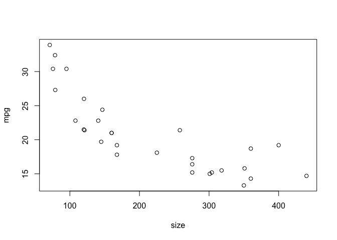
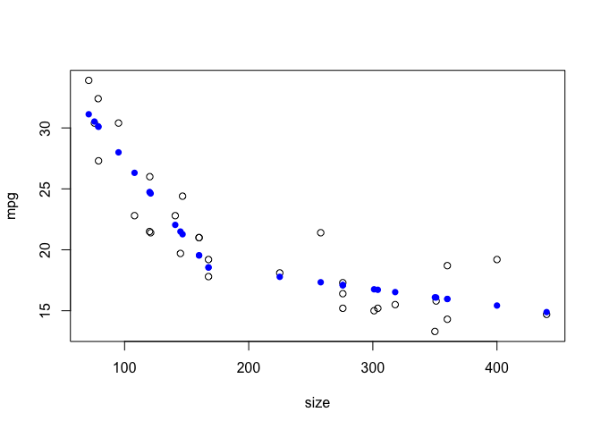

# Thursday, October 3: Transformations 

## Curves, Boundaries, Model Assumptions, Limit Range 


```r
load("/Users/isabellelangrock/Desktop/Stats500/Rst500.RData")
library(ltm)
```

```
## Loading required package: MASS
```

```
## Loading required package: msm
```

```
## Loading required package: polycor
```

```r
library(car) 
```

```
## Loading required package: carData
```

```r
library(ppcor)
```


```r
attach(cars)
plot(size,mpg)
```

<!-- -->

```r
straightenplot(size,mpg)
```

<!-- -->

```r
straightenplot(size,mpg, p=-4.5)
```

<!-- -->

```r
straightenplot(size,mpg,p=1,q=-1.5)
```

<!-- -->

```r
lmpg<-log(mpg)
rsize<1/size
```

```
##  [1] FALSE FALSE FALSE FALSE FALSE FALSE FALSE FALSE FALSE FALSE FALSE
## [12] FALSE FALSE FALSE FALSE FALSE FALSE FALSE FALSE FALSE FALSE FALSE
## [23] FALSE FALSE FALSE FALSE FALSE FALSE FALSE FALSE
```

```r
m<-lm(lmpg~rsize)
summary(m)
```

```
## 
## Call:
## lm(formula = lmpg ~ rsize)
## 
## Residuals:
##      Min       1Q   Median       3Q      Max 
## -0.18475 -0.07134 -0.02554  0.04886  0.22303 
## 
## Coefficients:
##             Estimate Std. Error t value Pr(>|t|)    
## (Intercept)   2.5823     0.0394   65.54  < 2e-16 ***
## rsize        66.5888     5.4992   12.11  1.2e-12 ***
## ---
## Signif. codes:  0 '***' 0.001 '**' 0.01 '*' 0.05 '.' 0.1 ' ' 1
## 
## Residual standard error: 0.1054 on 28 degrees of freedom
## Multiple R-squared:  0.8397,	Adjusted R-squared:  0.8339 
## F-statistic: 146.6 on 1 and 28 DF,  p-value: 1.203e-12
```

```r
plot(rsize,lmpg)
abline(m,col="blue")
```

<!-- -->

```r
plot(m)
```

<!-- --><!-- --><!-- --><!-- -->

```r
plot(size,mpg)
points(size,exp(2.58+66.59/size),pch=16, col="green")
```

<!-- -->

```r
carsplot()
```

<!-- -->

```r
attach(vocabulary)
```

```
## The following object is masked from package:carData:
## 
##     Vocab
```

```r
vocabulary
```

```
##     Age Vocab
## 1  0.67     0
## 2  0.83     1
## 3  1.00     3
## 4  1.25    19
## 5  1.50    22
## 6  1.75   118
## 7  2.00   272
## 8  2.50   446
## 9  3.00   896
## 10 3.50  1222
## 11 4.00  1540
## 12 4.50  1870
## 13 5.00  2072
## 14 5.50  2289
## 15 6.00  2562
```

```r
plot(Age,Vocab)
kink(Age, at=1/5)
```

```
##  [1] 0.47 0.63 0.80 1.05 1.30 1.55 1.80 2.30 2.80 3.30 3.80 4.30 4.80 5.30
## [15] 5.80
```

```r
kink
```

```
## function (x, at = NULL) 
## {
##     if (is.null(at)) 
##         at <- median(x)
##     z <- x - at
##     z[x < at] <- 0
##     z
## }
## attr(,"source")
## [1] "function(x,at=NULL){"            "\tif (is.null(at))at<-median(x)"
## [3] "\tz<-x-at"                       "\tz[x<at]<-0"                   
## [5] "\tz"                             "}"
```

```r
kink(Age, at=1.5)
```

```
##  [1] 0.00 0.00 0.00 0.00 0.00 0.25 0.50 1.00 1.50 2.00 2.50 3.00 3.50 4.00
## [15] 4.50
```

```r
cbind(Age,kink(Age, at=1.5))
```

```
##        Age     
##  [1,] 0.67 0.00
##  [2,] 0.83 0.00
##  [3,] 1.00 0.00
##  [4,] 1.25 0.00
##  [5,] 1.50 0.00
##  [6,] 1.75 0.25
##  [7,] 2.00 0.50
##  [8,] 2.50 1.00
##  [9,] 3.00 1.50
## [10,] 3.50 2.00
## [11,] 4.00 2.50
## [12,] 4.50 3.00
## [13,] 5.00 3.50
## [14,] 5.50 4.00
## [15,] 6.00 4.50
```

```r
plot(Age,Vocab)
```

<!-- -->

```r
summary(lm(Vocab~Age+kink(Age, at=1.5)))
```

```
## 
## Call:
## lm(formula = Vocab ~ Age + kink(Age, at = 1.5))
## 
## Residuals:
##      Min       1Q   Median       3Q      Max 
## -138.087  -22.182    1.278   22.627  111.817 
## 
## Coefficients:
##                     Estimate Std. Error t value Pr(>|t|)    
## (Intercept)           11.086     92.013   0.120    0.906    
## Age                   -9.365     73.540  -0.127    0.901    
## kink(Age, at = 1.5)  596.413     81.083   7.356 8.79e-06 ***
## ---
## Signif. codes:  0 '***' 0.001 '**' 0.01 '*' 0.05 '.' 0.1 ' ' 1
## 
## Residual standard error: 65.63 on 12 degrees of freedom
## Multiple R-squared:  0.9959,	Adjusted R-squared:  0.9953 
## F-statistic:  1468 on 2 and 12 DF,  p-value: 4.545e-15
```


```r
summary(lm(mpg~size+kink(size)))
```

```
## 
## Call:
## lm(formula = mpg ~ size + kink(size))
## 
## Residuals:
##     Min      1Q  Median      3Q     Max 
## -3.5154 -1.7346 -0.1548  1.4570  4.0633 
## 
## Coefficients:
##             Estimate Std. Error t value Pr(>|t|)    
## (Intercept) 40.38101    2.05775  19.624  < 2e-16 ***
## size        -0.13024    0.01568  -8.306 6.48e-09 ***
## kink(size)   0.11678    0.01996   5.851 3.14e-06 ***
## ---
## Signif. codes:  0 '***' 0.001 '**' 0.01 '*' 0.05 '.' 0.1 ' ' 1
## 
## Residual standard error: 2.275 on 27 degrees of freedom
## Multiple R-squared:  0.849,	Adjusted R-squared:  0.8378 
## F-statistic:  75.9 on 2 and 27 DF,  p-value: 8.25e-12
```

```r
plot(size,mpg)
points(size,lm(mpg~size+kink(size))$fitted,pch=16, col="blue")
```

<!-- -->

```r
#lmkink(size,mpg)
#(bcPower(size, -1), bcPower(mpg,0))
```
##for lmkink need to redownload workspace.


```r
#attach(loglog)
#plot(x,y)
#m<-lm(y~x)
#plot(log(x),log(y))
```


```r
#head(haystacks)
#dim(haystacks)
```


